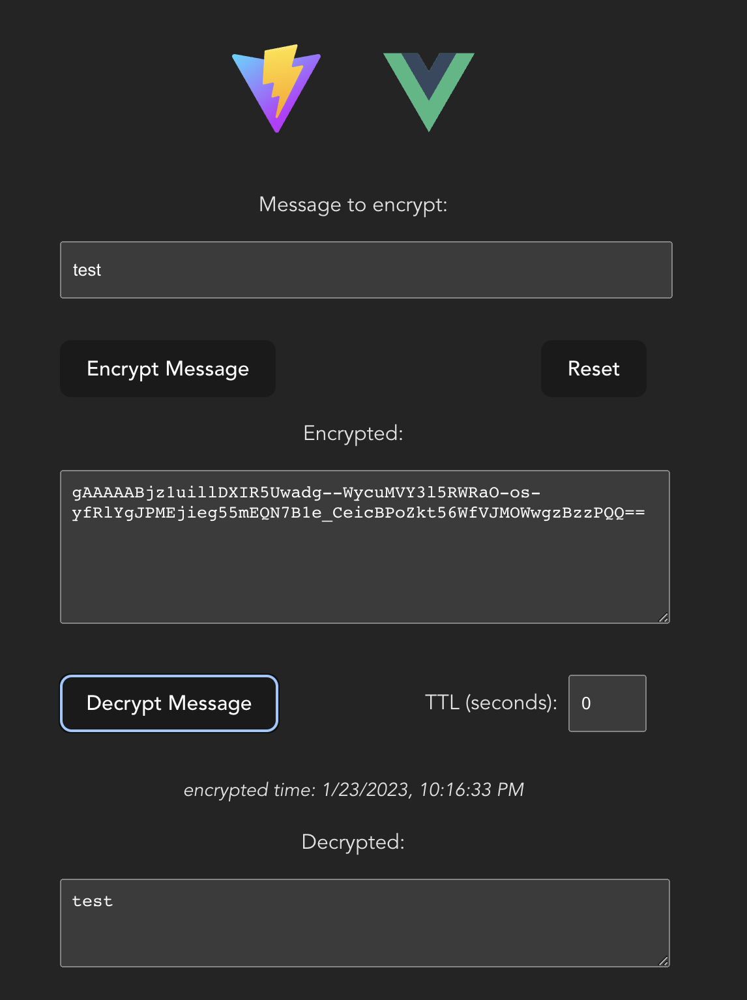

# fernet

**This is forked from [fernet.js](https://github.com/csquared/fernet.js) and has been modified for better es6 support**

TypeScript implementation of <a href="https://github.com/kr/fernet-spec">Fernet symmetric encryption</a>.

Fernet is an opinionated way of using AES and HMAC authentication that makes
shared-secret symmetric encryption simpler for communicating applications.

Instead of using TypedArrays I use Hex Strings and CryptoJS's `Hex.parse`
to build up `CryptoJs.lib.WordArray` objects.

## WARNING

[It's generally _never_ considered safe to encrypt data in the browser.](http://www.matasano.com/articles/javascript-cryptography/)

However, you can use this library to encrypt/decrypt data server-side and decrypt data on a client.

That being said, the only randomness used by this library without your control is a call to `crypto.randomBytes` to generate IVs.
This function defaults to OpenSSL server-side and [browserify's random number generator implementation](https://github.com/crypto-browserify/crypto-browserify/blob/master/index.js)
client-side. The browser implementation only uses real browser crypto or throws an error. (IE: no calls to `Math.random()`)

If you're planning on generating the secrets in the browser do yourself a favor and get an audit.

## Usage

### Use in Vite

Important! if you are using this library in [vite](https://vitejs.dev/) projects, you will need to shim the `global` variable. This is necessary due to the usage of the builtin `crypto` library and native `Buffer` objects. To work around this, simply define `global` in the `vite.config.ts` file:

```ts
import { defineConfig } from 'vite'
import vue from '@vitejs/plugin-vue'

// https://vitejs.dev/config/
export default defineConfig({
  define: {
    global: 'window'
  },
  plugins: [vue()],
})
```

There is an included [demo](https://github.com/CalebM1987/fernet/demo) application demonstrating the usage of this library. 

> note: See [Issue #1](https://github.com/CalebM1987/fernet/issues/1) for more details.
>
> 

### node.js (use `Token` and `Secret` directly)

```js
import { Token, Secret } from "fernet";
```

## Using Fernet in `es6`

### set top level properties by modifying the `defaults` object.

```js
import { defaults, Secret } from "fernet";

// set secret
defaults.secret = new Secret("cw_0x689RpI-jtRR7oE8h_eQsKImvJapLeSbXpwF4e4=");
```

Or can use the `setSecret` function to modify the global `defaults`:

```js
import { setSecret } from "fernet";

setSecret("cw_0x689RpI-jtRR7oE8h_eQsKImvJapLeSbXpwF4e4=");
```

Sets the `secret` at the top level (`defaults` object) for all further Tokens made.

```js
import { defaults } from "fernet";

defaults.ttl = seconds; //seconds is number of seconds
```

Sets the `ttl` at the top level (`defaults` object) for all further Tokens made.

## Secret

### Generating a secret

    Generating appropriate secrets is beyond the scope of `Fernet`, but you should
    generate it using `/dev/random` in a *nix. To generate a base64-encoded 256 bit
    (32 byte) random sequence, try:

    dd if=/dev/urandom bs=32 count=1 2>/dev/null | openssl base64

### new Secret(string)

```javascript
import { Secret } from "fernet";

const secret = new Secret("cw_0x689RpI-jtRR7oE8h_eQsKImvJapLeSbXpwF4e4=");
/*
  {
    signingKeyHex: '730ff4c7af3d46923e8ed451ee813c87',
    signingKey: [CryptoJS.lib.WordArray],
    encryptionKeyHex: 'f790b0a226bc96a92de49b5e9c05e1ee',
    encryptionKey: [CryptoJS.lib.WordArray]
  }
*/
```

## Token

## new Token(options)

Options:

- `secret`: a `Secret` object
- `token`: a Fernet-encoded String
- `ttl`: seconds of ttl

For testing:

- `time`: Date object
- `iv`: Array of Integers

### full Token.encode example

```javascript
import { Token, Secret } from "fernet";

// before creating a token, we must have a Secret()
const secret = new Secret("cw_0x689RpI-jtRR7oE8h_eQsKImvJapLeSbXpwF4e4=");

//Have to include time and iv to make it deterministic.
//Normally time would default to (new Date()) and iv to something random.
const token = new Token({
  secret: secret,
  time: Date.parse(1),
  iv: [0, 1, 2, 3, 4, 5, 6, 7, 8, 9, 10, 11, 12, 13, 14, 15]
});
token.encode("Message"); // returns the encypted message
/*
'gAAAAABSO_yhAAECAwQFBgcICQoLDA0OD1PGoFV6wgWZG6AOBfQqevwJT2qKtCZ0EjKy1_TvyxTseR_3ebIF6Ph-xa2QT_tEvg=='
*/
```

### Token.decode example

Include tt

```js
import { Token, Secret } from "fernet";

// must use same secret that encoded the token
const secret = new Secret("cw_0x689RpI-jtRR7oE8h_eQsKImvJapLeSbXpwF4e4=");

const token = new Token({
  secret: secret,
  token:
    "gAAAAABSO_yhAAECAwQFBgcICQoLDA0OD1PGoFV6wgWZG6AOBfQqevwJT2qKtCZ0EjKy1_TvyxTseR_3ebIF6Ph-xa2QT_tEvg==",
  ttl: 0
});
token.decode();
```

### fernet.setSecret(string)

Sets the `secret` at the top level for all further Tokens made
from this instance of Fernet.

### defaults.ttl = seconds

Sets the `ttl` at the default for all further Tokens made.

## Build

to build, make sure you have [typescript](https://www.npmjs.com/package/typescript) and [ts-node](https://www.npmjs.com/package/ts-node) installed globally and run:

    > npm run build

## Test

    > npm test

tests node lib with [Jest](https://jestjs.io).


